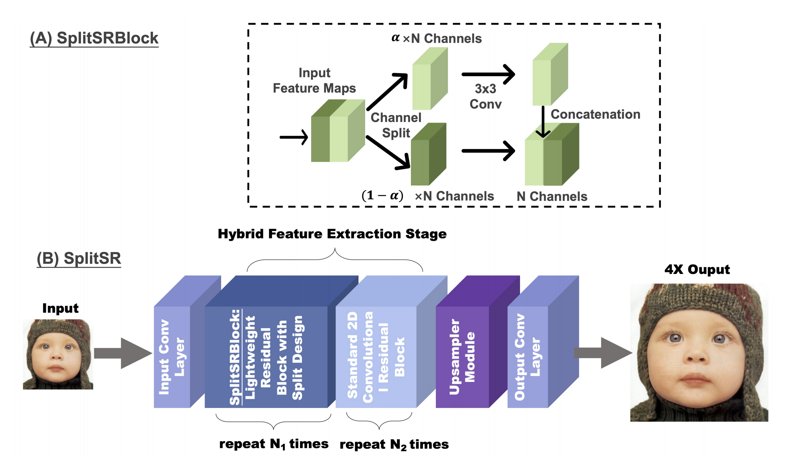

# SplitSR
Unofficial implementation of [SplitSR: An End-to-End Approach to Super-Resolution on Mobile Devices](https://arxiv.org/abs/2101.07996)

## Keys from the Paper
- Split convolution splits input by alpha ratio along depth channel.
- The conv-processed part is concatenated at the end.
- By the second key point, every channel would be processed after 1/α blocks.
- The theoretical computation reduction that can be obtained by using SplitSR is 𝛼^2, where 𝛼 ∈ (0, 1]
- The architecture is very much similar to RCAN's, by replacing channelwise attention blocks with split convolutions.
- Many proposed details are ambiguous. We've to guess.

## Config
- 𝛼 = 0.250
- Groups = 6, Blocks = 6
- Hybrid Index = 3
- Loss - L1
- Base LR - 1e-4
- LR Decay - 2.0 every 2 × 10^2
- Adam, 𝛽1 = 0.9, 𝛽2 = 0.999
- 𝜖 = 1e−7
- Steps = 6 × 10^5

## Progress
- Splitted Convolution Block is done.
- Residual Block is done.
- Mean shift layer is done.
- Beta version of model is ready.